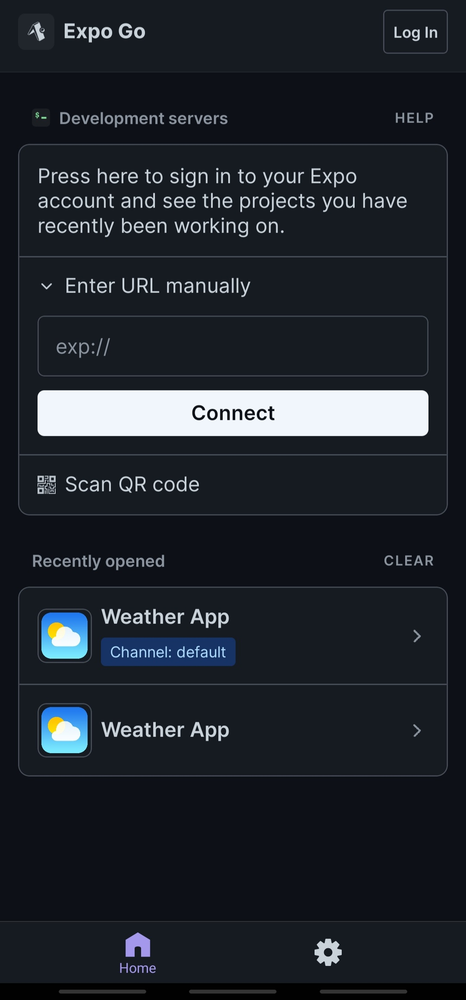
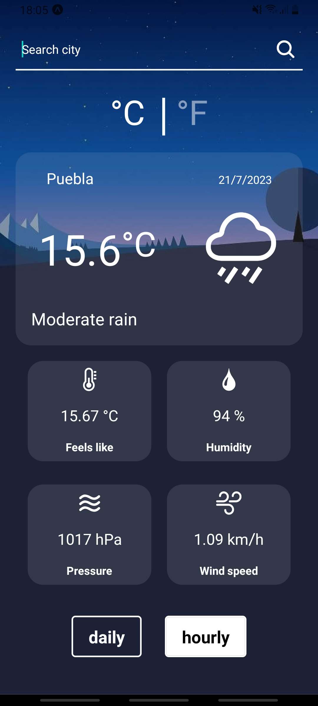
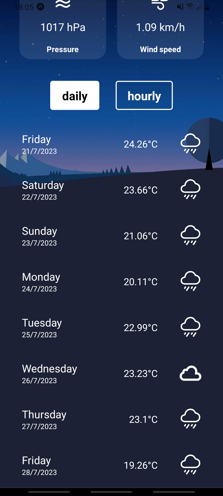
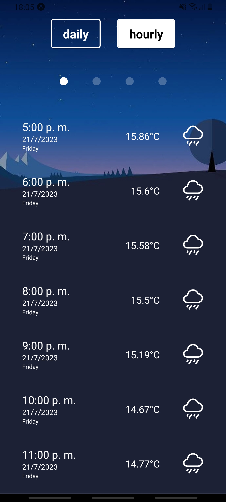
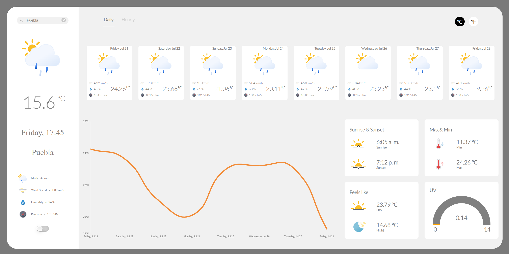

# Responsive Weather App using React, React Native, TypeScript, Redux, ChartJS and OpenWeather API

This project showcases weather-related information sourced from the OpenWeatherMap API, which is based on the user's specified city. The application provides essential weather data, including:

- Temperature, available in both Celsius and Fahrenheit.
- Humidity levels.
- Atmospheric pressure.
- Wind speed.
- Sunrise and Sunset time.
- Feels Like Temperature.
- Min & Max Temperature.
- Current UV index.

Additionally, the application offers a comprehensive weather forecast for the upcoming 7 days and an hourly forecast for the next 48 hours, starting from the moment the weather data is requested for a particular city.

For this project, two versions were developed: 
- The mobile version using React Native 
- The website version using React.

# React Native Version

The development environment utilized for creating the React Native version incorporates Expo, which allows project visualization by entering the following URL into the Expo application. 

exp://exp.host/@houser97/weather-app?release-channel=default

  

The application employs icons provided by Expo. It features an input field to enter the desired city and view its weather information. Users can also select between metric or imperial units for the displayed data.

  

The mobile version presents the following weather information:

- Temperature.
- Humidity.
- Pressure.
- Wind speed.

Additionally, two buttons are available to filter the weather forecast, offering the choice to view it either by day or by the hour.

  

When the forecast is set to hourly, four circles are provided for further filtering, displaying only the next 12 hours' worth of weather cards.

  

# Website Version

The website version offers additional information compared to the mobile version. It includes a line graph that visualizes the temperature trends over time based on the selected forecast option. Additionally, this version presents all data listed at the beginning of this file.

  

Furthermore, a toggle button has been implemented to allow users to switch between the light and dark themes of the application. Additionally, a gauge graphic has been added to display the current UV Index (UVI) smoothly.

  

To enhance user experience, a Carousel has been integrated to showcase prediction cards, dynamically adjusting to the screen size. Despite having a mobile version, the website version adapts seamlessly to any screen size, ensuring a clutter-free interface and optimal user experience.

  

